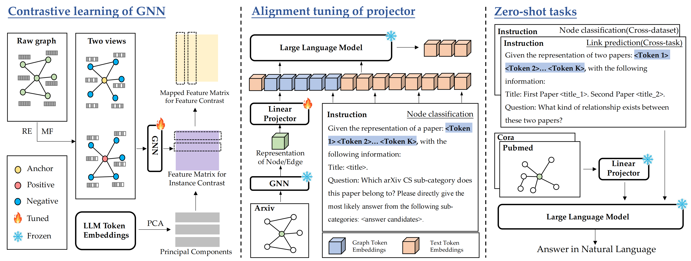

# <center> LLMs as Zero-shot Graph Learners: Alignment of GNN Representations with LLM Token Embeddings (NeurIPS 2024)</center>


The official implementation of work "LLMs as Zero-shot Graph Learners: Alignment of GNN Representations with LLM Token Embeddings".



## 1. Environment

```shell
# create a environment
conda create -n teaglm python=3.9
conda activate teaglm

# pytorch 1.13.1 cuda 11.7
conda install pytorch==1.13.1 torchvision==0.14.1 torchaudio==0.13.1 pytorch-cuda=11.7 -c pytorch -c nvidia

# install related libraries
pip install -r requirements.txt

# pyg related libraries
wget https://data.pyg.org/whl/torch-1.13.0%2Bcu117/torch_scatter-2.1.0%2Bpt113cu117-cp39-cp39-linux_x86_64.whl
wget https://data.pyg.org/whl/torch-1.13.0%2Bcu117/torch_sparse-0.6.16%2Bpt113cu117-cp39-cp39-linux_x86_64.whl
wget https://data.pyg.org/whl/torch-1.13.0%2Bcu117/torch_cluster-1.6.0%2Bpt113cu117-cp39-cp39-linux_x86_64.whl
wget https://data.pyg.org/whl/torch-1.13.0%2Bcu117/torch_spline_conv-1.2.1%2Bpt113cu117-cp39-cp39-linux_x86_64.whl
wget https://data.pyg.org/whl/torch-1.13.0%2Bcu117/pyg_lib-0.2.0%2Bpt113cu117-cp39-cp39-linux_x86_64.whl

pip install torch_scatter-2.1.0+pt113cu117-cp39-cp39-linux_x86_64.whl
pip install torch_sparse-0.6.16+pt113cu117-cp39-cp39-linux_x86_64.whl
pip install torch_cluster-1.6.0+pt113cu117-cp39-cp39-linux_x86_64.whl
pip install torch_spline_conv-1.2.1+pt113cu117-cp39-cp39-linux_x86_64.whl
pip install pyg_lib-0.2.0+pt113cu117-cp39-cp39-linux_x86_64.whl
```

## 2. Data

- [Graph data](https://huggingface.co/datasets/W-rudder/graphs/tree/main), saved to `./data`.
- [Instructions](https://huggingface.co/datasets/W-rudder/instructions/tree/main), saved to `./instruction`.

## 3. Train

### 3.1 Self-supervised of GNN

Run self-supervised on arxiv, then the model will be saved to `GNNPreTrain/saved_model`. We also upload the trained GNN checkpoint on [Hugging Face](https://huggingface.co/W-rudder/TEA-GLM/tree/main) , you can find them under `W-rudder/TEA-GLM/gnn`.

```shell
cd GNNPreTrain

# example on citation
python train_valid_paper.py --gpu 0 --num_runs 1 --drop_edge_rate_1 0.3 --drop_edge_rate_2 0.4 --drop_feature_rate_1 0.0 --drop_feature_rate_2 0.1

# move model for stage 2 train
mkdir -p ../saved_model/gnn | cp ./saved_model/model_file.pth ../saved_model/gnn/
```

### 3.2 Alignment tuning

Fill blanks at [train_arxiv.sh](scripts/train_arxiv.sh), then run the script below. We also upload the trained Projector checkpoint on [Hugging Face](https://huggingface.co/W-rudder/TEA-GLM/tree/main) , you can find them under `W-rudder/TEA-GLM/first_model`.

```shell
# if you directly download the gnn checkpoint, ignore this step
cd ..

# train
bash ./script/train_arxiv.sh
```

## 4. Evaluation

Fill blanks at [test_citation.sh](scripts/test_citation.sh) or [test_ecom.sh](scripts/test_citation.sh), then run the script. The generation results will be saved to `./results`

```shell
# generate on citation datasets
bash ./script/test_citation.sh

# generate on ecom datasets
bash ./script/test_ecom.sh
```


